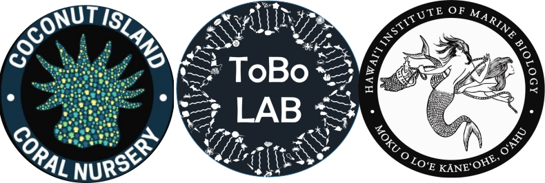

<body>

Can ecology be harnessed to promote restoration and prevent decline?

Can we farm coral?

Can we grow a coral reef?

</body>

The HIMB Coral Nursery aims to answer these and other questions in support of research and education at HIMB. It started as a pilot project to determine if it is possible to farm coral and improve reef restoration using a floating midwater coral nursery.  

The nursery was constructed in 2017 by recycling dolphin and fish pens that were decommissioned. Corals had naturally settled on the nets of these pens over the course of approximately 10 years, these corals were rescued with the assistance and guidance of the State of Hawaiʻi Division of Aquatic Resources (DAR).  

**Figure 1. Left** DAR staff and volunteers removing coral from decommissioned dolphin pens. **Right** Mesh racks used to transport corals by paddleboard to floating midwater racks.

The pilot project has been successful, with racks  increasing in coral cover from approximately %50 in 2017 to ~80% in 2020 **(Figure 2a,b)**.  We have documented recruitment of juvenile fish and coral **(Figure 2c)**. The HIMB nursery has also enabled dozens of student research projects, providing coral to researchers with no harm to the reef.

**Figure 2.** examples of coral growth and recruitment at the HIMB Nursery. **(a)** rack of coral in 2017, **(b)** the same rack in 2020, **(c)** example of coral recruitment on the HIMB Nursery racks.

Juvenile fish began to thrive in this new habitat, doing the hard work of cleaning algae so the corals can grow:

<iframe width="560" height="315" src="https://www.youtube.com/embed/OC37PyxF9Jo" frameborder="0" allow="accelerometer; autoplay; encrypted-media; gyroscope; picture-in-picture" allowfullscreen></iframe>

Here is the same rack as in the fish time-lapse video above after two years of growth:

<iframe width="560" height="315" src="https://www.youtube.com/embed/maO661zyRgQ" frameborder="0" allow="accelerometer; autoplay; encrypted-media; gyroscope; picture-in-picture" allowfullscreen></iframe>

## HIMB Coral Nursery projects

#### Coral Growth Assays
Restoration projects need data to find out the optimal genotype and size of coral to plant at a particular site. Thanks to funding from the Seaver Institute, and the NOAA Coral Reef Conservation Program, and in collaboration with the DAR Coral Nursery, we have developed Coral Growth Assays that can be used in the field to provide this information. The assays use micro-fragmentation to control size and coral genotype on each unit. The assays provide data on which genotype and which size category is optimal for each site.

**Figure 3.** Examples of coral modules that can also serve as growth assays. **(A)** *P. compressa* grown from ~0.4cm2 fragments at in the DAR coral Nursery. **(B)** *M. capitata* at the DAR coral nursery. **(C)** *P. compressa* at the HIMB nursery. **(D)** *M. capitata* at the HIMB coral nursery. **(E)** coral modules placed on sand and rubble on an HIMB reef flat.

We are measuring the assays with digital photography and with 3D SfM photogrametry to measure change in surface area and volume:
<iframe width="560" height="315" src="https://www.youtube.com/embed/-bKyCrAhH-4" frameborder="0" allow="accelerometer; autoplay; encrypted-media; gyroscope; picture-in-picture" allowfullscreen></iframe>

#### 3D SfM photogrametry of the Nursery
We are experimenting with using 3D photogrametry to quantify coral growth over ~100m2 of coral growing in the nursery.

**Figure 4.** 3D SfM can be used to measure coral growth **(Left Column)** October 2019, **(Middle Column)** February 2020, scaled 3D models juxtaposed with green indicating coral growth **(Right Column)**

#### Coral Seedlings
Small tetrapods were designed by SECORE to serve as settlement substrates for coral larvae. Chamberland et al. [(2017)](https://www.nature.com/articles/s41598-017-17555-z) documented that these tetrapods reduced transplantation costs by several orders of magnitude by eliminating diver time in the water and the tetrapods wedged into cracks and crevices eliminating the need for epoxy or other attachment methods. We have used micro-fragmentation to cover these tetrapods in both a mid-water nursery, and a land based nursery. The tetrapods could be mass produced in a variety of sizes and micro-fragmentation could be used to produce ‘coral seedlings’. This concept has yet to be tested in the field.

**Figure 5.** Prototype coral seedlings. **(A)** prototype coral seedling modules of various sizes and shapes designed to grow and self-attach to the substrate **(B)** a coral seedling with coral micro-fragments starting to attach after 3 months **(C)** seedlings covered with coral tissue after 1 year of growth in the *ex-situ* nursery.

#### Community Interactions
The HIMB Coral Nursery provides an opportunity to study ecological interactions. We are particularly interested in ecological interactions that promote positive feedback cycles that result in more rapid increase in coral cover. Density, size, and diversity dependent effects are focal areas for future work.  

### Student Projects and presentations:
- Austin Greene, (PhD candidate) Coral microbiome experiments and development of [CoralCam: a flexible, low-cost ecological monitoring platform.](https://www.sciencedirect.com/science/article/pii/S2468067219300537)
- Anne Chung, PhD (2018) UH Mānoa. Translating resilience-based management from theory to practice in Hawaiʻi.
- Maggie McGilly, MSc (2019) University of York. *In-situ* floating coral nurseries: a new source of juvenile fish recruitment?
- Andrew Thompson, MSc (2019) University of York. Genotypic resilience to sedimentation and its effects on the survivorship of coral micro-fragments during a bleaching event in Kāne‘ohe Bay, Hawai’i.
- Cristina McIntyre, MSc (2018) University of York. Spatial, temporal and environmental factors relating to the predation of *Porites compressa* coral by the nudibranch *Phestilla sibogae*.
- Rangel M, Bell S, Pacini AF, Forsman ZH, Knapp ISS, Toonen RJ (*in review*) Screaming at corals: 1-100kHz anthropogenic sounds show little effect on sessile coral reef invertebrates. PeerJ.
- Knapp ISS, Forsman ZH, Toonen RJ (2018) Nothing ventured nothing gained: establishing an *in-situ* coral nursery at the Hawai‘i Institute of Marine Biology. Symposium on science in support of archipelagic management. Oʻahu HI.
- Courtney Yoshiyama (STEM High School Capstone Project: testing coral growth on textures and colors of substrates).
- Jessica MacGregor (Hollings Scholar).
- Peter Chen (Hollings Scholar).
- McKenna Lewis (Hollings Scholar).
- Constance Sartor (Hollings Scholar).
- Also thanks to the many volunteers who have contributed to the project.

## Support & Funding
- Thanks to the many volunteers that made this work possible!
- Thanks to [Dr. Ingrid Knapp](http://tobolab.org/people/postdoctoral-researchers/ingrid-knapp/) (designer of Coral Nursery and ToBo lab icons) for helping on all fronts.
- Thanks to the State of Hawaiʻi Division of Aquatic Resources for permitting, guidance and collaboration.
- Special thanks to the Seaver Institute and the [NOAA Coral Reef Conservation Program](https://coralreef.noaa.gov/) and the Takeshi Tomo Trust, for funding nursery related projects.
- Thanks to the [ToBo lab](http://tobolab.org/) & [HIMB](http://www.himb.hawaii.edu/).

